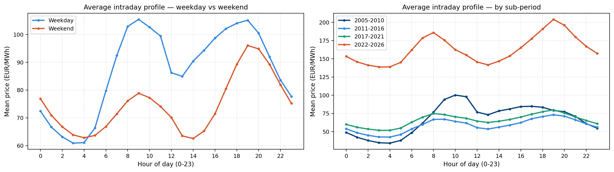
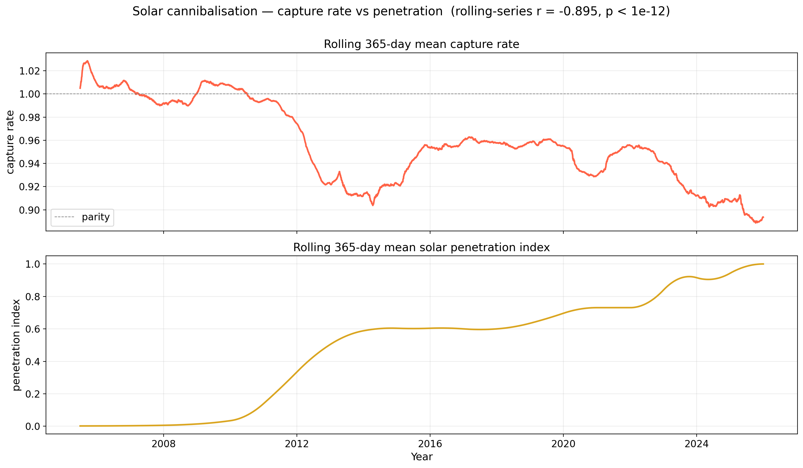
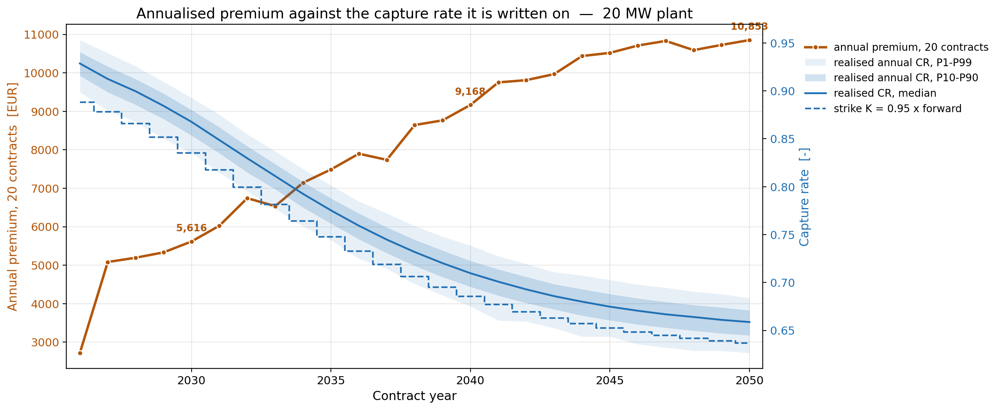

# Solar Revenue Index & Capture-Rate Hedge

A master's thesis project modelling how rising solar penetration erodes the
price a solar plant actually captures in the Italian day-ahead market (the
**capture rate**), and pricing a contract that hedges that erosion.

**Stack:** Python · pandas · statsmodels (SARIMA) · `arch` (GARCH) · SciPy ·
scikit-learn · Monte Carlo simulation · copula dependence modelling.
Eighteen Jupyter notebooks, orchestrated end to end by
[`Code/pipeline.ipynb`](Code/pipeline.ipynb).

## The question

As more solar capacity joins the grid, it all generates at the same sunny
hours, pushing the midday price down exactly when solar plants are
producing — a plant increasingly earns less than the average market price.
This project:

1. Builds 21 years (2005-2025) of hourly Italian day-ahead prices and
   collocated weather (temperature, irradiance) for one grid point.
2. Fits models for the market price, solar output, temperature, and the
   dependence between them.
3. Monte Carlo-simulates the joint system forward to 2050 under different
   solar-penetration and temperature scenarios.
4. Prices a capture-rate hedge contract against the simulated outcomes.

## What the numbers show

**The duck curve emerging over time.** The average intraday price profile
flattens and then dips at midday as solar penetration grows across sub-periods.



**Capture rate falling as penetration rises.** The rolling 365-day capture
rate (price actually captured / average market price) tracks the solar
penetration index almost one-for-one in the opposite direction (r = -0.90).



**The hedge premium a plant would pay for it.** Simulating the capture rate
forward, the fair premium on a strike indexed to the plant's own forward
capture rate roughly triples from the 2020s to 2050 (EUR 3,535 to EUR 9,610
per lot) as the erosion compounds.



**Under the hood:** a rescaled-logit + ARMA(2,1) clearness index, a
Fourier + AR(2)-t temperature model, a SARIMA(1,0,0)×(1,0,1)₇ + GARCH(1,1)
skewed-t capture-rate process, and a 3-D Student-t copula (ν = 17,
ΔAIC = −36.42 vs. Gaussian) tying the three together — then 5,000
Monte Carlo paths to 2050 and a Lee & Oren (2009) three-agent equilibrium
price for the hedge. Every fitted parameter and its sourcing is in
[`MODEL_SPECS.md`](Code/Models/MODEL_SPECS.md).

## Pipeline

```
Data/Raw/ (external downloads)
        │
        ▼
0. Transformation   parse GME prices, merge ERA5+CAMS weather → Data/Cleaned/
        │
        ▼
1. Modelling        fit solar (Kt), temperature, capture-rate, and copula models
        │            → Data/Modelled/, Code/Models/
        ▼
2. Scenario Paths   project temperature and solar-penetration paths to 2050
        │            → Data/Cleaned/*_scenarios.parquet
        ▼
3. Simulation       Monte Carlo the joint system (copula + margins), 5,000 paths
        │            → Data/Simulated/  (multi-GB, not tracked)
        ▼
4. Results          revenue index, risk metrics, and the capture-rate hedge
                     → Data/Results/    (tables; figures render inline, not tracked)
```

`Code/pipeline.ipynb` runs all five stages in order, skipping any stage whose
outputs are already newer than its inputs. See its first cell for the full
notebook list per stage.

## Repository layout

| Path | Contents |
|---|---|
| `Code/Transformation/` | Ingest and clean the two raw data sources |
| `Code/EDA/` | Exploratory analysis (price, weather) |
| `Code/Modelling/` | Fit the solar, temperature, capture-rate, and copula models |
| `Code/Scenarios/` | Project temperature and solar-penetration paths to 2050 |
| `Code/Simulation/` | Monte Carlo simulation, revenue index, and the hedge contract |
| `Code/Models/` | Fitted model parameters; see [`MODEL_SPECS.md`](Code/Models/MODEL_SPECS.md) for every value |
| `Code/model_utils.py` | Shared production-chain formulas and path-integrity guards |
| `Code/risk_metrics.py` | Shared VaR/CVaR/Sortino/drawdown functions |
| `Code/pipeline.ipynb` | Orchestrates all five stages, skipping any that are already fresh |
| `Data/Raw/` | External downloads (not tracked — see Reproducing below) |
| `Data/Cleaned/` | Tracked: the two cleaned series everything else is built on |
| `Data/Modelled/` | Tracked: fitted series (solar, temperature, capture rate) |
| `Data/Simulated/`, `Data/Results/` | Generated by the pipeline; not tracked (large) |
| `docs/figures/` | The figures embedded in this README |
| `Insights.txt` | Informal running notes on modelling decisions |

## Reproducing

```bash
python -m venv .venv
.venv/Scripts/activate         # .venv/bin/activate on macOS/Linux
pip install -r requirements.txt
```

The two raw weather files (`Data/Raw/reanalysis-era5-single-levels-timeseries-*.nc`,
`Data/Raw/cams_solar_irradiance_ts.nc`) come from the Copernicus Climate Data
Store (ERA5 single-levels reanalysis) and the CAMS Radiation Service, both
free with a CDS/ADS account, requested for `45.5N, 11.25E`. The price archive
(`Data/Raw/MGP_Prezzi*.zip`) is GME's public MGP day-ahead market history.

With `Data/Raw/` populated, run `Code/pipeline.ipynb` top to bottom (or open
`Code/Transformation/` and `Code/Modelling/` notebooks individually). Anyone
who only wants to explore the modelling and simulation stages can start
directly from the tracked `Data/Cleaned/` and `Data/Modelled/` parquets and
skip the raw downloads entirely.

## Known limitations

Every fitted parameter is documented, including its assumptions and
recorded caveats, in [`Code/Models/MODEL_SPECS.md`](Code/Models/MODEL_SPECS.md). Headline points:

- The capture-rate margin's PIT (`U_CR`) does not fully clear its own
  uniformity test (KS p = 0.023); the gap is recorded rather than hidden,
  and treated as a warning, not a hard failure, consistent with how the
  copula notebook treats its other two margins.
- The dependence copula is elliptical (t-copula), which understates the
  asymmetry between good-weather/low-capture-rate days and the reverse —
  a conservative bias for the hedge premium, kept deliberately rather than
  fixed with a more complex vine copula.
- The temperature model's degrees-of-freedom parameter differs slightly
  between the marginal fit and the copula fit; not yet reconciled.
- The weather grid point (`45.5N, 11.25E`) is roughly 115 km from Bologna
  proper, inside the same NORD bidding zone; file and variable names still
  say "Bologna" for historical reasons.
